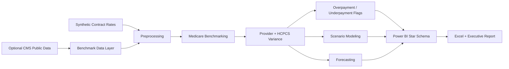

# Medicare Reimbursement Benchmarking System


An end-to-end Medicare reimbursement benchmarking system that compares synthetic provider contract rates against CMS-style Medicare benchmarks, detects overpayment/underpayment patterns, and exports a Power BI-ready star schema for executive dashboarding.

**Important:** Provider contract rates are synthetic. CMS integration is optional and public-data based. This project does not use private patient-level claims or actual hospital contract rates.

**Tech stack:** Python, SQL, pandas, Excel, Power BI, DAX, CMS Medicare public data references, pytest, GitHub Actions.

## Key Features

| Capability | What It Answers |
| --- | --- |
| Medicare Benchmarking | Which providers and services are above or below Medicare benchmark? |
| Provider Benchmarking | Which providers create the largest contract variance and financial exposure? |
| HCPCS Analysis | Which procedure codes drive over-Medicare or under-Medicare payment patterns? |
| Overpayment / Underpayment Detection | Which provider-service rows need reimbursement review? |
| Scenario Modeling | What happens if rates increase, decrease, or align to Medicare? |
| Forecasting | What is the projected monthly spend and benchmark variance? |
| Power BI Star Schema | How can the outputs be modeled in an executive BI dashboard? |
| Executive Reporting | What should leadership review first? |
| SQL Layer | How would the same logic translate into warehouse reporting? |

## Quick Start

```bash
pip install -r requirements.txt
python src/run_pipeline.py
pytest
```

Power BI CSVs are generated in:

```text
outputs/powerbi/
```

## Example Business Questions

- Which providers are paid above or below Medicare benchmark?
- Which HCPCS/procedure codes create the largest reimbursement variance?
- Which providers have high financial exposure from contract changes?
- What is the projected impact of increasing or decreasing rates?
- Where are potential underpayment or overpayment patterns?
- What should leadership review first?

## Architecture



## Data Sources

The project supports optional local CMS public files:

- CMS Physician Fee Schedule: https://pfs.data.cms.gov/datasets
- CMS Physician Fee Schedule API information: https://pfs.data.cms.gov/about/api
- CMS Medicare Physician & Other Practitioners by Provider and Service: https://data.cms.gov/provider-summary-by-type-of-service/medicare-physician-other-practitioners/medicare-physician-other-practitioners-by-provider-and-service

Expected optional files:

```text
data/raw/cms_fee_schedule.csv
data/raw/cms_provider_service.csv
```

If files are missing, the pipeline generates realistic CMS-style benchmark data and labels the source as simulated.

## Methodology

Core benchmark calculations:

```text
contract_to_medicare_ratio = contract_allowed_amount / medicare_benchmark_amount
dollar_variance = contract_allowed_amount - medicare_benchmark_amount
percent_variance = dollar_variance / medicare_benchmark_amount
total_financial_variance = dollar_variance * utilization_count
```

Benchmark bands:

- `below_80_percent_of_medicare`
- `80_to_100_percent`
- `100_to_120_percent`
- `above_120_percent`

Scenario models:

- all-rate increase/decrease
- Medicare alignment
- provider contract change
- service category change

## Power BI Dashboard Layer

The pipeline exports normalized, Power BI-ready CSVs every time it runs:

```text
outputs/powerbi/dim_provider.csv
outputs/powerbi/dim_hcpcs.csv
outputs/powerbi/dim_state.csv
outputs/powerbi/dim_time.csv
outputs/powerbi/fact_reimbursement.csv
outputs/powerbi/fact_scenario_impact.csv
outputs/powerbi/fact_forecast.csv
outputs/powerbi/fact_flags.csv
```

The `.pbix` file is not committed. Build it manually in Power BI Desktop using the exported CSVs and docs.

Power BI documentation:

- [Power BI data model](docs/powerbi_data_model.md)
- [Dashboard specification](docs/powerbi_dashboard_spec.md)
- [DAX measures](docs/powerbi_dax_measures.md)
- [Power Query steps](docs/power_query_steps.md)

Dashboard pages:

1. Executive Overview
2. Provider Benchmarking
3. HCPCS / Procedure Analysis
4. Overpayment / Underpayment Review
5. Scenario Modeling & Forecast

## Outputs

### Analytics Tables

```text
outputs/tables/provider_benchmarking.csv
outputs/tables/hcpcs_variance_analysis.csv
outputs/tables/reimbursement_variance.csv
outputs/tables/overpayment_flags.csv
outputs/tables/underpayment_flags.csv
outputs/tables/scenario_impact_summary.csv
outputs/tables/forecast_summary.csv
outputs/tables/executive_kpis.csv
```

### Figures


### Reports

```text
outputs/reports/executive_summary.md
outputs/reports/executive_workbook.xlsx
```

Workbook tabs:

- Executive Summary
- Provider Benchmarking
- HCPCS Variance
- Overpayment Flags
- Underpayment Flags
- Scenario Impact
- Forecast Summary

## SQL Layer

The `sql/` folder includes:

- reimbursement variance
- provider benchmarking
- HCPCS rate analysis
- contract impact model
- executive summary

## Repository Structure

```text
medicare-reimbursement-benchmarking-system/
├── README.md
├── requirements.txt
├── data/
├── docs/
├── outputs/
│   ├── figures/
│   ├── powerbi/
│   ├── reports/
│   └── tables/
├── sql/
├── src/
└── tests/
```

## Limitations

- Synthetic contract rates are not actual payer or hospital contracts.
- CMS public data is optional and must be downloaded locally by the user.
- Public CMS provider/service data is aggregated and not patient-level claims data.
- Forecasts are baseline planning estimates and do not claim model accuracy without backtesting.
- A `.pbix` file is not committed unless manually created outside the pipeline.

## Future Improvements

- Build and publish a `.pbix` template using the exported star schema.
- Add locality, modifier, facility/non-facility, and year-specific Physician Fee Schedule logic.
- Add provider specialty and place-of-service normalization.
- Add contract term and fee schedule version tracking.
- Add forecast backtesting and confidence intervals.
