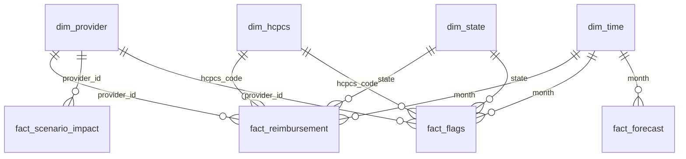

# Power BI Data Model

## Star Schema

## Tables

| Table | Type | Grain | Description |
| --- | --- | --- | --- |
| `dim_provider.csv` | Dimension | One row per provider | Provider attributes, total services, risk score, risk tier, recommended action. |
| `dim_hcpcs.csv` | Dimension | One row per HCPCS code | Procedure description, service category, average benchmark, exposure rank. |
| `dim_state.csv` | Dimension | One row per state | State lookup for slicers and regional views. |
| `dim_time.csv` | Dimension | One row per month | Month, year, quarter, month number. |
| `fact_reimbursement.csv` | Fact | Provider-HCPCS-month-payer-contract row | Core reimbursement, benchmark, variance, utilization, and benchmark band metrics. |
| `fact_scenario_impact.csv` | Fact | One row per modeled scenario | Baseline spend, simulated spend, dollar impact, percent impact. |
| `fact_forecast.csv` | Fact | Forecast month and metric | Forecasted reimbursement spend, benchmark variance, and provider exposure. |
| `fact_flags.csv` | Fact | Flagged provider-HCPCS-month row | Overpayment and underpayment review queue. |

## Relationships

- `fact_reimbursement.provider_id -> dim_provider.provider_id`
- `fact_reimbursement.hcpcs_code -> dim_hcpcs.hcpcs_code`
- `fact_reimbursement.state -> dim_state.state`
- `fact_reimbursement.month -> dim_time.month`
- `fact_scenario_impact.provider_id -> dim_provider.provider_id`
- `fact_flags.provider_id -> dim_provider.provider_id`
- `fact_flags.hcpcs_code -> dim_hcpcs.hcpcs_code`
- `fact_flags.state -> dim_state.state`
- `fact_flags.month -> dim_time.month`
- `fact_forecast.month -> dim_time.month`

`fact_scenario_impact.provider_id` is currently blank for portfolio-level scenario rows. Keep the relationship inactive or omit it until provider-specific scenarios are expanded.

## Refresh Instructions

1. Run `python src/run_pipeline.py`.
2. Open Power BI Desktop.
3. Refresh all CSV queries pointed at `outputs/powerbi/`.
4. Confirm relationships remain active.
5. Validate executive KPIs against `outputs/tables/executive_kpis.csv`.
